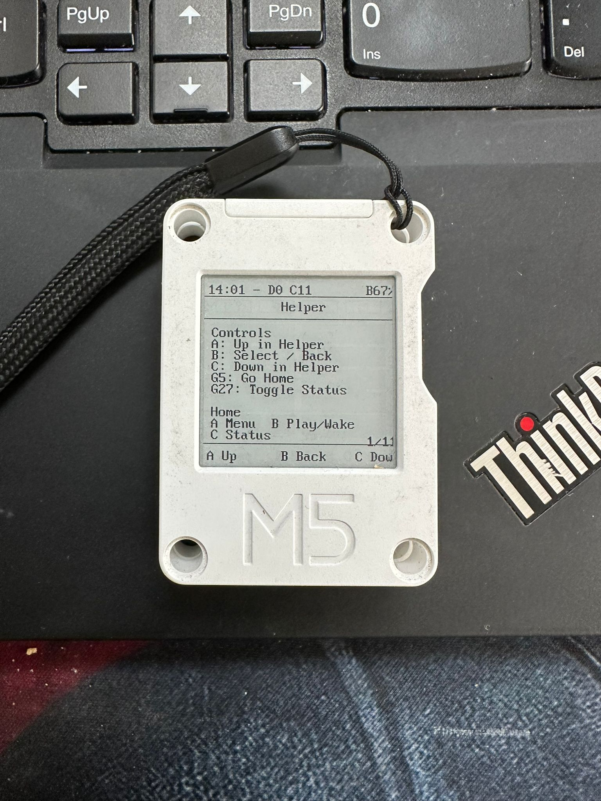
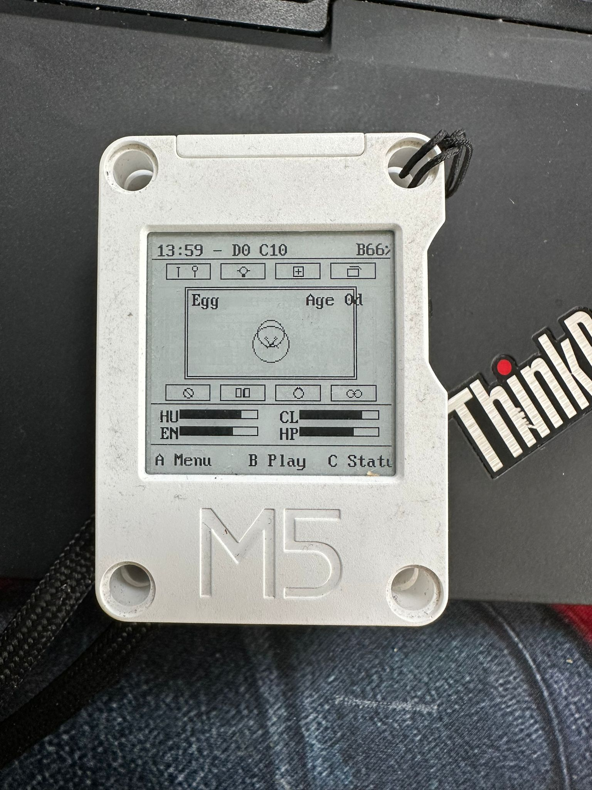
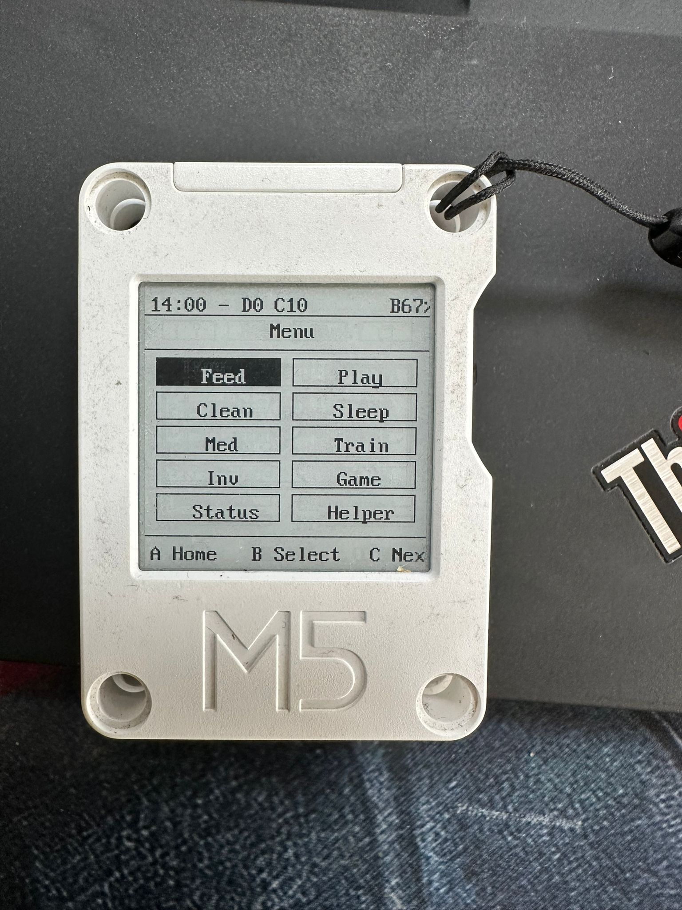

# ExistentialEgg
A Tamagotchi-style firmware project for **M5 Core Ink**.

You raise a tiny grayscale creature that depends on you for survival, then rewards you with anxiety. 

You feed it, it stares back, both of you question reality.

## What It Does
- Simulates a pet with hunger, happiness, cleanliness, energy, health, discipline, and weight.
- Evolves stages over time: egg to elder, like all things headed toward entropy.
- Includes menu actions, inventory, status screen, helper screen, and a reaction mini-game.
- Applies offline progress, so neglect still counts even when you pretend you were "busy."
- Saves state to NVS with a CRC check to protect your hard-earned digital guilt.

## Small Gallery

| UI     | Image                                                     |
|--------|-----------------------------------------------------------|
| Helper |  |
| Home   |    |
| Menu   |    |
| Status |  |

I know, i know. The UI could use some improvements...

## Build and Upload
```bash
pio run -t upload
```

## Local Verification
```bash
pio run
```

## Controls
- `A` = up/back
- `B` = select/confirm
- `C` = down/next
- `GPIO 5` (top hardware button) = instant home
- `GPIO 27` (side hardware button) = quick toggle status/home

## CI, Docs, and Versioning
This repo uses `.github/workflows/ci.yaml`:
- On every push and pull request: builds firmware with PlatformIO.
- After successful build: generates Doxygen HTML docs and uploads artifact `doxygen-html`.
- On pushes to `main`: calculates semantic version and pushes a `v*` tag.

## Hardware
Tested on **M5 Core Ink**.
